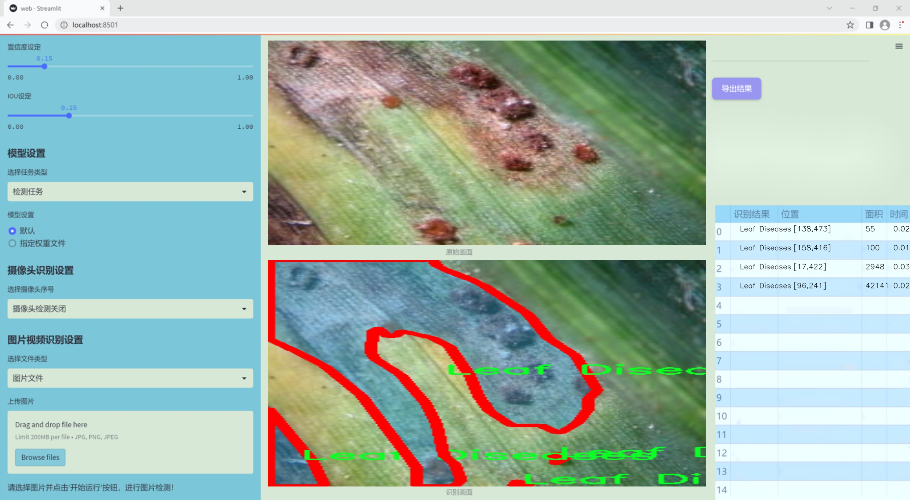

### 1.背景意义

研究背景与意义

随着全球农业现代化进程的加快，植物病害的检测与管理逐渐成为保障农作物产量和质量的重要环节。辣椒作为一种广泛种植的经济作物，其病害的发生不仅影响了农民的经济收益，也对食品安全和生态环境造成了潜在威胁。因此，开发高效、准确的辣椒叶病害检测系统具有重要的现实意义和应用价值。

近年来，深度学习技术在计算机视觉领域取得了显著进展，尤其是目标检测和实例分割任务中，YOLO（You Only Look Once）系列模型因其高效性和实时性而受到广泛关注。YOLOv11作为该系列的最新版本，结合了更先进的网络结构和算法优化，能够在复杂环境中实现快速而准确的目标检测。通过对YOLOv11的改进，能够进一步提升辣椒叶病害的检测精度和速度，为农民提供及时的病害预警。

本研究将基于改进的YOLOv11模型，构建一个针对辣椒叶病害的检测系统。该系统将利用包含1200张图像的Cabai-Daun数据集，该数据集涵盖了多种辣椒叶病害的实例，包括叶片病害、果实病害、卷叶、黄叶等多种类型。通过对这些数据的深入分析和模型训练，期望实现对辣椒叶病害的自动识别与分类，从而为农民提供科学的病害管理建议，降低农作物损失。

此外，随着人工智能技术的不断发展，基于深度学习的病害检测系统也为农业智能化提供了新的思路。通过将该系统与物联网技术相结合，可以实现对辣椒种植环境的实时监控与数据分析，进而推动精准农业的发展。因此，本研究不仅具有学术价值，还有助于提升农业生产效率，促进可持续发展。

### 2.视频效果

[2.1 视频效果](https://www.bilibili.com/video/BV1vmquYpEhi/)

### 3.图片效果





##### [项目涉及的源码数据来源链接](https://kdocs.cn/l/cszuIiCKVNis)**

注意：本项目提供训练的数据集和训练教程,由于版本持续更新,暂不提供权重文件（best.pt）,请按照6.训练教程进行训练后实现上图演示的效果。

### 4.数据集信息

##### 4.1 本项目数据集类别数＆类别名

nc: 5
names: ['Leaf Diseases', 'fruit-chili', 'keriting', 'kuning', 'leaf-chili']


该项目为【图像分割】数据集，请在【训练教程和Web端加载模型教程（第三步）】这一步的时候按照【图像分割】部分的教程来训练

##### 4.2 本项目数据集信息介绍

本项目数据集信息介绍

本项目旨在改进YOLOv11模型，以实现高效的辣椒叶病害检测系统。为此，我们构建了一个专门的数据集，名为“Cabai-Daun”，该数据集涵盖了辣椒植物的多种病害及其健康状态。数据集的类别数量为五个，具体包括“Leaf Diseases”（叶病）、“fruit-chili”（果实-辣椒）、“keriting”（卷曲）、“kuning”（黄叶）和“leaf-chili”（叶子-辣椒）。这些类别的选择不仅反映了辣椒植物在生长过程中可能遭遇的各种病害，还涵盖了健康果实的特征，为模型的训练提供了丰富的样本。

在数据集的构建过程中，我们采集了大量的辣椒叶片和果实图像，确保每个类别的样本数量充足且多样化。这些图像来自不同的生长环境和气候条件，涵盖了不同的辣椒品种，以提高模型的泛化能力。每张图像都经过精心标注，确保模型能够准确识别出各种病害的特征。数据集中的“Leaf Diseases”类别包含了多种常见的叶片病害，如白粉病、霜霉病等，帮助模型学习到不同病害的视觉特征。而“fruit-chili”类别则提供了健康果实的图像，以便模型能够区分健康与病害果实。

此外，数据集还包括“keriting”和“kuning”这两个特定病害类别，分别对应辣椒叶片的卷曲和黄化现象。这些病害常常是由病原体感染或环境压力引起的，识别这些症状对于及时采取防治措施至关重要。最后，“leaf-chili”类别则专注于健康的辣椒叶片，为模型提供了一个对比的基础，使其能够更好地识别出病害的发生。

通过对“Cabai-Daun”数据集的深入分析和训练，我们期望能够显著提升YOLOv11在辣椒叶病害检测中的准确性和效率，为农业生产提供更为可靠的技术支持。


### 5.全套项目环境部署视频教程（零基础手把手教学）

[5.1 所需软件PyCharm和Anaconda安装教程（第一步）](https://www.bilibili.com/video/BV1BoC1YCEKi/?spm_id_from=333.999.0.0&vd_source=bc9aec86d164b67a7004b996143742dc)


[5.2 安装Python虚拟环境创建和依赖库安装视频教程（第二步）](https://www.bilibili.com/video/BV1ZoC1YCEBw?spm_id_from=333.788.videopod.sections&vd_source=bc9aec86d164b67a7004b996143742dc)

### 6.改进YOLOv11训练教程和Web_UI前端加载模型教程（零基础手把手教学）

[6.1 改进YOLOv11训练教程和Web_UI前端加载模型教程（第三步）](https://www.bilibili.com/video/BV1BoC1YCEhR?spm_id_from=333.788.videopod.sections&vd_source=bc9aec86d164b67a7004b996143742dc)


按照上面的训练视频教程链接加载项目提供的数据集，运行train.py即可开始训练



     Epoch   gpu_mem       box       obj       cls    labels  img_size
     1/200     20.8G   0.01576   0.01955  0.007536        22      1280: 100%|██████████| 849/849 [14:42<00:00,  1.04s/it]
               Class     Images     Labels          P          R     mAP@.5 mAP@.5:.95: 100%|██████████| 213/213 [01:14<00:00,  2.87it/s]
                 all       3395      17314      0.994      0.957      0.0957      0.0843

     Epoch   gpu_mem       box       obj       cls    labels  img_size
     2/200     20.8G   0.01578   0.01923  0.007006        22      1280: 100%|██████████| 849/849 [14:44<00:00,  1.04s/it]
               Class     Images     Labels          P          R     mAP@.5 mAP@.5:.95: 100%|██████████| 213/213 [01:12<00:00,  2.95it/s]
                 all       3395      17314      0.996      0.956      0.0957      0.0845

     Epoch   gpu_mem       box       obj       cls    labels  img_size
     3/200     20.8G   0.01561    0.0191  0.006895        27      1280: 100%|██████████| 849/849 [10:56<00:00,  1.29it/s]
               Class     Images     Labels          P          R     mAP@.5 mAP@.5:.95: 100%|███████   | 187/213 [00:52<00:00,  4.04it/s]
                 all       3395      17314      0.996      0.957      0.0957      0.0845


###### [项目数据集下载链接](https://kdocs.cn/l/cszuIiCKVNis)

### 7.原始YOLOv11算法讲解

YOLO11采用改进的骨干和颈部架构，增强了特征提取能力，提高了物体检测的精确度和复杂任务的表现。YOLO11引入精炼的架构设计和优化的训练流程，实现更快的处理速度，同时保持精度和性能之间的最佳平衡。通过模型设计的进步，YOLO11m在COCO数据集上实现了更高的均值平均精度（mAP），同时使用比YOLOv8m少22%的参数，使其在不妥协准确性的情况下更加计算高效。YOLO11可以无缝部署在各种环境中，包括边缘设备、云平台以及支持NVIDIA
GPU的系统，确保最大灵活性。无论是物体检测、实例分割、图像分类、姿态估计，还是定向物体检测（OBB），YOLO11都旨在应对多样的计算机视觉挑战。


##### **Ultralytics YOLO11相比于之前版本的主要改进有哪些？**

Ultralytics YOLO11在其前身基础上引入了几项重要进步。主要改进包括：

  1. **增强的特征提取** ：YOLO11采用改进的骨干和颈部架构，增强了特征提取能力，提高了物体检测的精确度。
  2.  **优化的效率和速度** ：精炼的架构设计和优化的训练流程实现了更快的处理速度，同时保持了准确性和性能之间的平衡。
  3.  **更高的准确性与更少的参数** ：YOLO11m在COCO数据集上实现了更高的均值平均精度（mAP），同时使用比YOLOv8m少22%的参数，使其在不妥协准确性的情况下更加计算高效。
  4.  **环境适应性强** ：YOLO11可以在多种环境中部署，包括边缘设备、云平台以及支持NVIDIA GPU的系统。
  5.  **支持广泛的任务** ：YOLO11支持多种计算机视觉任务，如物体检测、实例分割、图像分类、姿态估计和定向物体检测（OBB）。

我们先来看一下其网络结构有什么变化，可以看出，相比较于YOLOv8模型，其将CF2模块改成C3K2，同时在SPPF模块后面添加了一个C2PSA模块，且将YOLOv10的head思想引入到YOLO11的head中，使用深度可分离的方法，减少冗余计算，提高效率。下面我们来详细看一下这两个模块的结构是怎么构成的，以及它们为什么要这样设计


##### C3K2的网络结构

从下面图中我们可以看到，C3K2模块其实就是C2F模块转变出来的，它代码中有一个设置，就是当c3k这个参数为FALSE的时候，C3K2模块就是C2F模块，也就是说它的Bottleneck是普通的Bottleneck；反之当它为true的时候，将Bottleneck模块替换成C3模块。


##### C2PSA的网络结构

` `C2PSA是对 `C2f` 模块的扩展，它结合了PSA(Pointwise Spatial
Attention)块，用于增强特征提取和注意力机制。通过在标准 `C2f` 模块中引入 PSA
块，C2PSA实现了更强大的注意力机制，从而提高了模型对重要特征的捕捉能力。


##### **C2f 模块回顾：**

**** C2f模块是一个更快的 CSP（Cross Stage Partial）瓶颈实现，它通过两个卷积层和多个 Bottleneck
块进行特征提取。相比传统的 CSPNet，C2f 优化了瓶颈层的结构，使得计算速度更快。在 C2f中，`cv1` 是第一个 1x1
卷积，用于减少通道数；`cv2` 是另一个 1x1 卷积，用于恢复输出通道数。而 `n` 是一个包含 Bottleneck 块的数量，用于提取特征。

##### **C2PSA 模块的增强** ：

**C2PSA** 扩展了 C2f，通过引入PSA( **Position-Sensitive Attention)**
，旨在通过多头注意力机制和前馈神经网络来增强特征提取能力。它可以选择性地添加残差结构（shortcut）以优化梯度传播和网络训练效果。同时，使用FFN
可以将输入特征映射到更高维的空间，捕获输入特征的复杂非线性关系，允许模型学习更丰富的特征表示。

##### head部分

YOLO11在head部分的cls分支上使用深度可分离卷积 ，具体代码如下，cv2边界框回归分支，cv3分类分支。

    
    
     self.cv2 = nn.ModuleList(
                nn.Sequential(Conv(x, c2, 3), Conv(c2, c2, 3), nn.Conv2d(c2, 4 * self.reg_max, 1)) for x in ch
            )
            self.cv3 = nn.ModuleList(
                nn.Sequential(
                    nn.Sequential(DWConv(x, x, 3), Conv(x, c3, 1)),
                    nn.Sequential(DWConv(c3, c3, 3), Conv(c3, c3, 1)),
                    nn.Conv2d(c3, self.nc, 1),
                )
                for x in ch
            )


### 8.200+种全套改进YOLOV11创新点原理讲解

#### 8.1 200+种全套改进YOLOV11创新点原理讲解大全

由于篇幅限制，每个创新点的具体原理讲解就不全部展开，具体见下列网址中的改进模块对应项目的技术原理博客网址【Blog】（创新点均为模块化搭建，原理适配YOLOv5~YOLOv11等各种版本）

[改进模块技术原理博客【Blog】网址链接](https://gitee.com/qunmasj/good)


#### 8.2 精选部分改进YOLOV11创新点原理讲解

###### 这里节选部分改进创新点展开原理讲解(完整的改进原理见上图和[改进模块技术原理博客链接](https://gitee.com/qunmasj/good)【如果此小节的图加载失败可以通过CSDN或者Github搜索该博客的标题访问原始博客，原始博客图片显示正常】

### Gold-YOLO


#### Preliminaries
YOLO系列的中间层结构采用了传统的FPN结构，其中包含多个分支用于多尺度特征融合。然而，它只充分融合来自相邻级别的特征，对于其他层次的信息只能间接地进行“递归”获取。

传统的FPN结构在信息传输过程中存在丢失大量信息的问题。这是因为层之间的信息交互仅限于中间层选择的信息，未被选择的信息在传输过程中被丢弃。这种情况导致某个Level的信息只能充分辅助相邻层，而对其他全局层的帮助较弱。因此，整体上信息融合的有效性可能受到限制。
为了避免在传输过程中丢失信息，本文采用了一种新颖的“聚集和分发”机制（GD），放弃了原始的递归方法。该机制使用一个统一的模块来收集和融合所有Level的信息，并将其分发到不同的Level。通过这种方式，作者不仅避免了传统FPN结构固有的信息丢失问题，还增强了中间层的部分信息融合能力，而且并没有显著增加延迟。


#### 低阶聚合和分发分支 Low-stage gather-and-distribute branch
从主干网络中选择输出的B2、B3、B4、B5特征进行融合，以获取保留小目标信息的高分辨率特征。


#### 高阶聚合和分发分支 High-stage gather-and-distribute branch
高级全局特征对齐模块（High-GD）将由低级全局特征对齐模块（Low-GD）生成的特征{P3, P4, P5}进行融合。


Transformer融合模块由多个堆叠的transformer组成，transformer块的数量为L。每个transformer块包括一个多头注意力块、一个前馈网络（FFN）和残差连接。采用与LeViT相同的设置来配置多头注意力块，使用16个通道作为键K和查询Q的头维度，32个通道作为值V的头维度。为了加速推理过程，将层归一化操作替换为批归一化，并将所有的GELU激活函数替换为ReLU。为了增强变换器块的局部连接，在两个1x1卷积层之间添加了一个深度卷积层。同时，将FFN的扩展因子设置为2，以在速度和计算成本之间取得平衡。


信息注入模块(Information injection module)： 高级全局特征对齐模块（High-GD）中的信息注入模块与低级全局特征对齐模块（Low-GD）中的相同。在高级阶段，局部特征（Flocal）等于Pi，因此公式如下所示：


#### 增强的跨层信息流动 Enhanced cross-layer information flow
为了进一步提升性能，从YOLOv6 中的PAFPN模块中得到启发，引入了Inject-LAF模块。该模块是注入模块的增强版，包括了一个轻量级相邻层融合（LAF）模块，该模块被添加到注入模块的输入位置。为了在速度和准确性之间取得平衡，设计了两个LAF模型：LAF低级模型和LAF高级模型，分别用于低级注入（合并相邻两层的特征）和高级注入（合并相邻一层的特征）。它们的结构如图5(b)所示。为了确保来自不同层级的特征图与目标大小对齐，在实现中的两个LAF模型仅使用了三个操作符：双线性插值（上采样过小的特征）、平均池化（下采样过大的特征）和1x1卷积（调整与目标通道不同的特征）。模型中的LAF模块与信息注入模块的结合有效地平衡了准确性和速度之间的关系。通过使用简化的操作，能够增加不同层级之间的信息流路径数量，从而提高性能而不显著增加延迟。


### 9.系统功能展示

图9.1.系统支持检测结果表格显示

  图9.2.系统支持置信度和IOU阈值手动调节

  图9.3.系统支持自定义加载权重文件best.pt(需要你通过步骤5中训练获得)

  图9.4.系统支持摄像头实时识别

  图9.5.系统支持图片识别

  图9.6.系统支持视频识别

  图9.7.系统支持识别结果文件自动保存

  图9.8.系统支持Excel导出检测结果数据


### 10. YOLOv11核心改进源码讲解

#### 10.1 SwinTransformer.py

以下是经过精简和注释的Swin Transformer核心代码。该代码主要实现了Swin Transformer的基本结构，包括Patch Embedding、窗口注意力机制、MLP模块等。

```python
import torch
import torch.nn as nn
import torch.nn.functional as F
import numpy as np
from timm.models.layers import DropPath, to_2tuple, trunc_normal_

class Mlp(nn.Module):
    """多层感知机（MLP）模块"""
    def __init__(self, in_features, hidden_features=None, out_features=None, act_layer=nn.GELU, drop=0.):
        super().__init__()
        out_features = out_features or in_features  # 输出特征数
        hidden_features = hidden_features or in_features  # 隐藏层特征数
        self.fc1 = nn.Linear(in_features, hidden_features)  # 第一层线性变换
        self.act = act_layer()  # 激活函数
        self.fc2 = nn.Linear(hidden_features, out_features)  # 第二层线性变换
        self.drop = nn.Dropout(drop)  # Dropout层

    def forward(self, x):
        """前向传播"""
        x = self.fc1(x)  # 线性变换
        x = self.act(x)  # 激活
        x = self.drop(x)  # Dropout
        x = self.fc2(x)  # 线性变换
        x = self.drop(x)  # Dropout
        return x

def window_partition(x, window_size):
    """将输入张量分割成窗口"""
    B, H, W, C = x.shape  # 获取输入张量的形状
    x = x.view(B, H // window_size, window_size, W // window_size, window_size, C)  # 重新排列
    windows = x.permute(0, 1, 3, 2, 4, 5).contiguous().view(-1, window_size, window_size, C)  # 窗口排列
    return windows

def window_reverse(windows, window_size, H, W):
    """将窗口张量合并回原始形状"""
    B = int(windows.shape[0] / (H * W / window_size / window_size))  # 计算批次大小
    x = windows.view(B, H // window_size, W // window_size, window_size, window_size, -1)  # 重新排列
    x = x.permute(0, 1, 3, 2, 4, 5).contiguous().view(B, H, W, -1)  # 合并窗口
    return x

class WindowAttention(nn.Module):
    """窗口注意力机制模块"""
    def __init__(self, dim, window_size, num_heads, qkv_bias=True, attn_drop=0., proj_drop=0.):
        super().__init__()
        self.dim = dim
        self.window_size = window_size  # 窗口大小
        self.num_heads = num_heads  # 注意力头数
        head_dim = dim // num_heads  # 每个头的维度
        self.scale = head_dim ** -0.5  # 缩放因子

        # 相对位置偏置表
        self.relative_position_bias_table = nn.Parameter(
            torch.zeros((2 * window_size[0] - 1) * (2 * window_size[1] - 1), num_heads))

        # 计算相对位置索引
        coords_h = torch.arange(self.window_size[0])
        coords_w = torch.arange(self.window_size[1])
        coords = torch.stack(torch.meshgrid([coords_h, coords_w]))  # 生成网格坐标
        coords_flatten = torch.flatten(coords, 1)  # 展平
        relative_coords = coords_flatten[:, :, None] - coords_flatten[:, None, :]  # 计算相对坐标
        relative_coords = relative_coords.permute(1, 2, 0).contiguous()  # 重新排列
        relative_coords[:, :, 0] += self.window_size[0] - 1  # 移动到非负
        relative_coords[:, :, 1] += self.window_size[1] - 1
        relative_coords[:, :, 0] *= 2 * self.window_size[1] - 1
        self.register_buffer("relative_position_index", relative_coords.sum(-1))  # 注册为缓冲区

        self.qkv = nn.Linear(dim, dim * 3, bias=qkv_bias)  # 线性变换生成Q、K、V
        self.attn_drop = nn.Dropout(attn_drop)  # 注意力Dropout
        self.proj = nn.Linear(dim, dim)  # 输出线性变换
        self.proj_drop = nn.Dropout(proj_drop)  # 输出Dropout
        trunc_normal_(self.relative_position_bias_table, std=.02)  # 初始化相对位置偏置
        self.softmax = nn.Softmax(dim=-1)  # Softmax层

    def forward(self, x, mask=None):
        """前向传播"""
        B_, N, C = x.shape  # 获取输入形状
        qkv = self.qkv(x).reshape(B_, N, 3, self.num_heads, C // self.num_heads).permute(2, 0, 3, 1, 4)  # 计算Q、K、V
        q, k, v = qkv[0], qkv[1], qkv[2]  # 分离Q、K、V

        q = q * self.scale  # 缩放Q
        attn = (q @ k.transpose(-2, -1))  # 计算注意力

        # 添加相对位置偏置
        relative_position_bias = self.relative_position_bias_table[self.relative_position_index.view(-1)].view(
            self.window_size[0] * self.window_size[1], self.window_size[0] * self.window_size[1], -1)
        relative_position_bias = relative_position_bias.permute(2, 0, 1).contiguous()  # 重新排列
        attn = attn + relative_position_bias.unsqueeze(0)  # 添加偏置

        attn = self.softmax(attn)  # 计算Softmax
        attn = self.attn_drop(attn)  # 应用Dropout

        x = (attn @ v).transpose(1, 2).reshape(B_, N, C)  # 计算输出
        x = self.proj(x)  # 线性变换
        x = self.proj_drop(x)  # 应用Dropout
        return x

class SwinTransformer(nn.Module):
    """Swin Transformer主模块"""
    def __init__(self, patch_size=4, in_chans=3, embed_dim=96, depths=[2, 2, 6, 2], num_heads=[3, 6, 12, 24]):
        super().__init__()
        self.patch_embed = PatchEmbed(patch_size=patch_size, in_chans=in_chans, embed_dim=embed_dim)  # Patch嵌入
        self.layers = nn.ModuleList()  # 存储每一层
        for i_layer in range(len(depths)):
            layer = BasicLayer(
                dim=int(embed_dim * 2 ** i_layer),
                depth=depths[i_layer],
                num_heads=num_heads[i_layer])
            self.layers.append(layer)  # 添加层

    def forward(self, x):
        """前向传播"""
        x = self.patch_embed(x)  # Patch嵌入
        for layer in self.layers:
            x = layer(x)  # 通过每一层
        return x

# 定义Swin Transformer的构建函数
def SwinTransformer_Tiny(weights=''):
    model = SwinTransformer(depths=[2, 2, 6, 2], num_heads=[3, 6, 12, 24])  # 创建模型
    if weights:
        model.load_state_dict(torch.load(weights)['model'])  # 加载权重
    return model
```

### 代码核心部分说明：
1. **Mlp类**：实现了一个简单的多层感知机，包含两个线性层和一个激活函数，支持Dropout。
2. **window_partition和window_reverse函数**：实现了将输入张量分割成窗口和将窗口合并回原始形状的功能。
3. **WindowAttention类**：实现了窗口注意力机制，支持相对位置偏置的计算。
4. **SwinTransformer类**：构建了Swin Transformer的整体结构，包括Patch嵌入和多个基本层（BasicLayer）。
5. **SwinTransformer_Tiny函数**：提供了一个简单的接口来创建Swin Transformer模型并加载预训练权重。

通过这些核心部分，Swin Transformer能够有效地处理图像数据，进行特征提取和表示学习。

该文件实现了Swin Transformer模型的结构，Swin Transformer是一种用于计算机视觉任务的层次化视觉Transformer。该模型通过局部窗口注意力机制和逐层合并补丁来处理图像数据，具有较好的性能和效率。

首先，文件中定义了一个多层感知机（Mlp）类，该类包含两个线性层和一个激活函数（默认为GELU），并在每个线性层后面添加了Dropout层，以防止过拟合。接着，定义了两个辅助函数：`window_partition`和`window_reverse`，用于将输入特征分割成窗口和将窗口合并回原始形状。

接下来，`WindowAttention`类实现了基于窗口的多头自注意力机制（W-MSA），支持相对位置偏置。该类的构造函数中定义了相对位置偏置表，并计算了每个窗口内的相对位置索引。在前向传播中，输入特征被转换为查询、键和值，并计算注意力权重，最后通过线性变换和Dropout输出结果。

`SwinTransformerBlock`类则实现了Swin Transformer的基本块，包含了归一化层、窗口注意力层和多层感知机。该块的前向传播过程中，输入特征经过归一化、窗口分割、注意力计算、窗口合并以及残差连接和前馈网络处理。

`PatchMerging`类用于将输入特征进行补丁合并，降低特征图的分辨率。`BasicLayer`类则代表了Swin Transformer的一个基本层，包含多个Swin Transformer块，并在必要时进行补丁合并。

`PatchEmbed`类负责将输入图像划分为补丁并进行嵌入，使用卷积层进行线性投影，并在需要时进行归一化处理。

`SwinTransformer`类是整个模型的主体，构造函数中初始化了补丁嵌入层、位置嵌入、Dropout层以及多个基本层。模型的前向传播过程包括补丁嵌入、位置嵌入、经过每一层的处理，并在指定的输出层进行归一化处理。

最后，`update_weight`函数用于更新模型权重，`SwinTransformer_Tiny`函数则是一个工厂函数，用于创建一个小型的Swin Transformer模型实例，并可选择加载预训练权重。

整体来看，该文件实现了Swin Transformer的核心结构和功能，适用于图像分类、目标检测等计算机视觉任务。

#### 10.2 val.py

以下是代码中最核心的部分，并附上详细的中文注释：

```python
class DetectionValidator(BaseValidator):
    """
    DetectionValidator类用于基于检测模型的验证，继承自BaseValidator类。
    """

    def __init__(self, dataloader=None, save_dir=None, pbar=None, args=None, _callbacks=None):
        """初始化检测模型所需的变量和设置。"""
        super().__init__(dataloader, save_dir, pbar, args, _callbacks)
        self.nt_per_class = None  # 每个类别的目标数量
        self.is_coco = False  # 是否为COCO数据集
        self.class_map = None  # 类别映射
        self.args.task = "detect"  # 任务类型设置为检测
        self.metrics = DetMetrics(save_dir=self.save_dir, on_plot=self.on_plot)  # 初始化检测指标
        self.iouv = torch.linspace(0.5, 0.95, 10)  # mAP@0.5:0.95的IoU向量
        self.niou = self.iouv.numel()  # IoU的数量
        self.lb = []  # 用于自动标注

    def preprocess(self, batch):
        """对YOLO训练的图像批次进行预处理。"""
        # 将图像数据移动到指定设备并进行归一化处理
        batch["img"] = batch["img"].to(self.device, non_blocking=True)
        batch["img"] = (batch["img"].half() if self.args.half else batch["img"].float()) / 255
        for k in ["batch_idx", "cls", "bboxes"]:
            batch[k] = batch[k].to(self.device)

        # 如果需要保存混合数据，进行相应处理
        if self.args.save_hybrid:
            height, width = batch["img"].shape[2:]
            nb = len(batch["img"])
            bboxes = batch["bboxes"] * torch.tensor((width, height, width, height), device=self.device)
            self.lb = (
                [
                    torch.cat([batch["cls"][batch["batch_idx"] == i], bboxes[batch["batch_idx"] == i]], dim=-1)
                    for i in range(nb)
                ]
                if self.args.save_hybrid
                else []
            )  # 用于自动标注

        return batch

    def postprocess(self, preds):
        """对预测输出应用非极大值抑制（NMS）。"""
        return ops.non_max_suppression(
            preds,
            self.args.conf,
            self.args.iou,
            labels=self.lb,
            multi_label=True,
            agnostic=self.args.single_cls,
            max_det=self.args.max_det,
        )

    def update_metrics(self, preds, batch):
        """更新检测指标。"""
        for si, pred in enumerate(preds):
            self.seen += 1  # 记录已处理的图像数量
            npr = len(pred)  # 当前预测的数量
            stat = dict(
                conf=torch.zeros(0, device=self.device),
                pred_cls=torch.zeros(0, device=self.device),
                tp=torch.zeros(npr, self.niou, dtype=torch.bool, device=self.device),
            )
            pbatch = self._prepare_batch(si, batch)  # 准备当前批次的数据
            cls, bbox = pbatch.pop("cls"), pbatch.pop("bbox")  # 获取当前批次的真实类别和边界框
            nl = len(cls)  # 真实目标数量
            stat["target_cls"] = cls  # 记录真实类别

            if npr == 0:  # 如果没有预测结果
                if nl:
                    for k in self.stats.keys():
                        self.stats[k].append(stat[k])
                continue

            # 处理预测结果
            predn = self._prepare_pred(pred, pbatch)  # 准备预测数据
            stat["conf"] = predn[:, 4]  # 置信度
            stat["pred_cls"] = predn[:, 5]  # 预测类别

            # 评估
            if nl:
                stat["tp"] = self._process_batch(predn, bbox, cls)  # 计算真正例
            for k in self.stats.keys():
                self.stats[k].append(stat[k])  # 更新统计信息

    def get_stats(self):
        """返回指标统计信息和结果字典。"""
        stats = {k: torch.cat(v, 0).cpu().numpy() for k, v in self.stats.items()}  # 转换为numpy数组
        if len(stats) and stats["tp"].any():
            self.metrics.process(**stats)  # 处理指标
        self.nt_per_class = np.bincount(
            stats["target_cls"].astype(int), minlength=self.nc
        )  # 计算每个类别的目标数量
        return self.metrics.results_dict  # 返回结果字典
```

### 代码核心部分说明：
1. **DetectionValidator类**：用于YOLO模型的验证，继承自BaseValidator类，包含了模型验证所需的所有功能。
2. **__init__方法**：初始化检测模型的参数，包括数据加载器、保存目录、任务类型、指标等。
3. **preprocess方法**：对输入的图像批次进行预处理，包括数据类型转换和归一化。
4. **postprocess方法**：对模型的预测结果应用非极大值抑制（NMS），以去除冗余的边界框。
5. **update_metrics方法**：更新模型的性能指标，包括真正例、置信度和预测类别等。
6. **get_stats方法**：计算并返回检测结果的统计信息，包含每个类别的目标数量和其他性能指标。

这些方法共同构成了YOLO模型在验证阶段的核心逻辑，确保模型能够有效地评估其在给定数据集上的性能。

这个程序文件 `val.py` 是一个用于目标检测模型验证的类，主要是基于 YOLO（You Only Look Once）模型的实现。它继承自 `BaseValidator` 类，包含了多种方法来处理数据集、计算指标、生成可视化结果等。

首先，文件导入了一些必要的库，包括操作系统相关的库、路径处理库、NumPy 和 PyTorch。还引入了与 YOLO 相关的数据处理和验证工具。

`DetectionValidator` 类的构造函数初始化了一些必要的变量和设置，包括数据加载器、保存目录、进度条、参数和回调函数。它还定义了一些与 COCO 数据集相关的属性，比如是否是 COCO 数据集、类别映射等。接着，它初始化了一些用于计算检测指标的对象，如 `DetMetrics` 和 `ConfusionMatrix`。

在 `preprocess` 方法中，程序对输入的图像批次进行预处理，包括将图像转换为适合模型输入的格式，并根据需要进行归一化处理。它还会根据参数决定是否保存混合标签。

`init_metrics` 方法用于初始化评估指标，确定当前使用的数据集是否为 COCO 数据集，并设置相应的类别映射和指标名称。

`get_desc` 方法返回一个格式化的字符串，用于总结 YOLO 模型的类别指标。

`postprocess` 方法对模型的预测结果应用非极大值抑制（NMS），以减少重叠的检测框。

`_prepare_batch` 和 `_prepare_pred` 方法分别用于准备输入批次和预测结果，以便进行后续的评估。

`update_metrics` 方法负责更新指标，处理每个批次的预测结果和真实标签，并计算相关的统计信息。

`finalize_metrics` 方法设置最终的指标值和混淆矩阵。

`get_stats` 方法返回计算后的指标统计信息，并更新每个类别的目标数量。

`print_results` 方法打印训练或验证集的每个类别的指标，包括总的检测数量和每个类别的结果。

`_process_batch` 方法计算正确预测的矩阵，基于 IOU（Intersection over Union）来匹配预测框和真实框。

`build_dataset` 和 `get_dataloader` 方法用于构建数据集和返回数据加载器，方便后续的验证过程。

`plot_val_samples` 和 `plot_predictions` 方法用于可视化验证样本和预测结果，生成相应的图像文件。

`save_one_txt` 方法将 YOLO 检测结果保存为特定格式的文本文件，`pred_to_json` 方法将预测结果序列化为 COCO JSON 格式。

最后，`eval_json` 方法用于评估 YOLO 输出的 JSON 格式，并返回性能统计信息，使用 COCO API 计算 mAP（mean Average Precision）。

总体而言，这个文件实现了一个完整的目标检测模型验证流程，涵盖了数据处理、指标计算、结果可视化等多个方面。

#### 10.3 afpn.py

以下是代码中最核心的部分，并附上详细的中文注释：

```python
import torch
import torch.nn as nn
import torch.nn.functional as F

# 定义基本的卷积块
class BasicBlock(nn.Module):
    def __init__(self, filter_in, filter_out):
        super(BasicBlock, self).__init__()
        # 第一个卷积层，使用3x3卷积
        self.conv1 = Conv(filter_in, filter_out, 3)
        # 第二个卷积层，使用3x3卷积，不使用激活函数
        self.conv2 = Conv(filter_out, filter_out, 3, act=False)

    def forward(self, x):
        residual = x  # 保存输入作为残差

        out = self.conv1(x)  # 通过第一个卷积层
        out = self.conv2(out)  # 通过第二个卷积层

        out += residual  # 将输入与卷积输出相加
        return self.conv1.act(out)  # 返回激活后的输出


# 定义上采样模块
class Upsample(nn.Module):
    def __init__(self, in_channels, out_channels, scale_factor=2):
        super(Upsample, self).__init__()
        # 上采样模块，先进行1x1卷积，然后进行双线性插值上采样
        self.upsample = nn.Sequential(
            Conv(in_channels, out_channels, 1),
            nn.Upsample(scale_factor=scale_factor, mode='bilinear')
        )

    def forward(self, x):
        return self.upsample(x)  # 返回上采样后的输出


# 定义下采样模块，支持不同的下采样倍数
class Downsample_x2(nn.Module):
    def __init__(self, in_channels, out_channels):
        super(Downsample_x2, self).__init__()
        # 2倍下采样
        self.downsample = Conv(in_channels, out_channels, 2, 2, 0)

    def forward(self, x):
        return self.downsample(x)  # 返回下采样后的输出


class ASFF_2(nn.Module):
    def __init__(self, inter_dim=512):
        super(ASFF_2, self).__init__()
        self.inter_dim = inter_dim
        compress_c = 8  # 压缩通道数

        # 定义用于计算权重的卷积层
        self.weight_level_1 = Conv(self.inter_dim, compress_c, 1)
        self.weight_level_2 = Conv(self.inter_dim, compress_c, 1)
        self.weight_levels = nn.Conv2d(compress_c * 2, 2, kernel_size=1, stride=1, padding=0)
        self.conv = Conv(self.inter_dim, self.inter_dim, 3)  # 最后的卷积层

    def forward(self, input1, input2):
        # 计算每个输入的权重
        level_1_weight_v = self.weight_level_1(input1)
        level_2_weight_v = self.weight_level_2(input2)

        # 合并权重并计算最终权重
        levels_weight_v = torch.cat((level_1_weight_v, level_2_weight_v), 1)
        levels_weight = self.weight_levels(levels_weight_v)
        levels_weight = F.softmax(levels_weight, dim=1)  # 使用softmax归一化权重

        # 融合输入
        fused_out_reduced = input1 * levels_weight[:, 0:1, :, :] + \
                            input2 * levels_weight[:, 1:2, :, :]

        out = self.conv(fused_out_reduced)  # 通过卷积层
        return out  # 返回融合后的输出


class BlockBody_P345(nn.Module):
    def __init__(self, channels=[64, 128, 256, 512]):
        super(BlockBody_P345, self).__init__()

        # 定义不同尺度的卷积块和下采样、上采样模块
        self.blocks_scalezero1 = nn.Sequential(Conv(channels[0], channels[0], 1))
        self.blocks_scaleone1 = nn.Sequential(Conv(channels[1], channels[1], 1))
        self.blocks_scaletwo1 = nn.Sequential(Conv(channels[2], channels[2], 1))

        self.downsample_scalezero1_2 = Downsample_x2(channels[0], channels[1])
        self.upsample_scaleone1_2 = Upsample(channels[1], channels[0], scale_factor=2)

        self.asff_scalezero1 = ASFF_2(inter_dim=channels[0])
        self.asff_scaleone1 = ASFF_2(inter_dim=channels[1])

    def forward(self, x):
        x0, x1, x2 = x  # 输入为三个不同尺度的特征图

        # 通过卷积块处理每个尺度的特征图
        x0 = self.blocks_scalezero1(x0)
        x1 = self.blocks_scaleone1(x1)
        x2 = self.blocks_scaletwo1(x2)

        # 进行特征融合
        scalezero = self.asff_scalezero1(x0, self.upsample_scaleone1_2(x1))
        scaleone = self.asff_scaleone1(self.downsample_scalezero1_2(x0), x1)

        return scalezero, scaleone  # 返回融合后的特征图


class AFPN_P345(nn.Module):
    def __init__(self, in_channels=[256, 512, 1024], out_channels=256, factor=4):
        super(AFPN_P345, self).__init__()

        # 定义输入特征图的卷积层
        self.conv0 = Conv(in_channels[0], in_channels[0] // factor, 1)
        self.conv1 = Conv(in_channels[1], in_channels[1] // factor, 1)
        self.conv2 = Conv(in_channels[2], in_channels[2] // factor, 1)

        # 定义主干网络
        self.body = BlockBody_P345([in_channels[0] // factor, in_channels[1] // factor, in_channels[2] // factor])

        # 定义输出特征图的卷积层
        self.conv00 = Conv(in_channels[0] // factor, out_channels, 1)
        self.conv11 = Conv(in_channels[1] // factor, out_channels, 1)
        self.conv22 = Conv(in_channels[2] // factor, out_channels, 1)

    def forward(self, x):
        x0, x1, x2 = x  # 输入为三个不同尺度的特征图

        # 通过卷积层处理输入特征图
        x0 = self.conv0(x0)
        x1 = self.conv1(x1)
        x2 = self.conv2(x2)

        # 通过主干网络进行特征融合
        out0, out1, out2 = self.body([x0, x1, x2])

        # 通过输出卷积层处理融合后的特征图
        out0 = self.conv00(out0)
        out1 = self.conv11(out1)
        out2 = self.conv22(out2)

        return [out0, out1, out2]  # 返回输出特征图
```

### 代码核心部分解释：
1. **BasicBlock**: 定义了一个基本的卷积块，包含两个卷积层和残差连接。
2. **Upsample/Downsample**: 定义了上采样和下采样模块，分别用于特征图的尺寸调整。
3. **ASFF**: 自适应特征融合模块，通过计算权重对不同尺度的特征图进行加权融合。
4. **BlockBody_P345**: 处理不同尺度特征图的主干网络，包含多个卷积块和融合模块。
5. **AFPN_P345**: 定义了一个特征金字塔网络，输入多个尺度的特征图并输出融合后的特征图。

这些模块结合在一起形成了一个强大的特征提取和融合网络，适用于各种计算机视觉任务。

这个程序文件 `afpn.py` 实现了一个基于深度学习的特征金字塔网络（AFPN），用于图像处理任务，特别是在目标检测和分割等计算机视觉任务中。代码主要由多个类组成，每个类实现了特定的功能模块。

首先，程序导入了一些必要的库，包括 `torch` 和 `torch.nn`，并定义了一些自定义的卷积层和模块。这些模块的主要功能是处理输入特征图的不同尺度，以便在后续的网络中进行特征融合。

在 `BasicBlock` 类中，定义了一个基本的卷积块，包含两个卷积层和残差连接。残差连接有助于缓解深层网络中的梯度消失问题，增强模型的学习能力。

接下来，定义了一系列上采样和下采样的模块（如 `Upsample`、`Downsample_x2`、`Downsample_x4`、`Downsample_x8`），这些模块用于调整特征图的尺寸，以便在不同尺度之间进行特征融合。

`ASFF_2`、`ASFF_3` 和 `ASFF_4` 类实现了自适应特征融合模块（ASFF），这些模块根据输入特征图的权重动态地融合来自不同尺度的特征图。每个模块通过计算输入特征图的权重，并使用软最大化函数进行归一化，从而实现加权融合。

`BlockBody_P345` 和 `BlockBody_P2345` 类是网络的主体部分，分别处理三层和四层特征图。它们通过定义多个卷积块和自适应特征融合模块，构建了一个复杂的特征提取网络。这些类中的 `forward` 方法定义了前向传播的具体过程，处理输入特征图并返回经过处理的特征图。

`AFPN_P345` 和 `AFPN_P2345` 类是整个网络的顶层，负责接收输入特征图并通过调用主体部分进行处理。它们还包括一些卷积层，用于调整输出特征图的通道数。初始化过程中，使用了 Xavier 初始化方法来初始化卷积层的权重，以提高训练的稳定性。

最后，`AFPN_P345_Custom` 和 `AFPN_P2345_Custom` 类允许用户自定义块类型，提供了更大的灵活性，用户可以根据需求选择不同的卷积块。

整体来看，这个程序文件实现了一个功能强大的特征金字塔网络，能够有效地处理多尺度特征，适用于各种计算机视觉任务。

#### 10.4 starnet.py

以下是代码中最核心的部分，并附上详细的中文注释：

```python
import torch
import torch.nn as nn
from timm.models.layers import DropPath, trunc_normal_

class ConvBN(torch.nn.Sequential):
    """
    定义一个卷积层 + 批归一化层的组合
    """
    def __init__(self, in_planes, out_planes, kernel_size=1, stride=1, padding=0, dilation=1, groups=1, with_bn=True):
        super().__init__()
        # 添加卷积层
        self.add_module('conv', torch.nn.Conv2d(in_planes, out_planes, kernel_size, stride, padding, dilation, groups))
        # 如果需要，添加批归一化层
        if with_bn:
            self.add_module('bn', torch.nn.BatchNorm2d(out_planes))
            # 初始化批归一化层的权重和偏置
            torch.nn.init.constant_(self.bn.weight, 1)
            torch.nn.init.constant_(self.bn.bias, 0)

class Block(nn.Module):
    """
    定义StarNet中的基本模块
    """
    def __init__(self, dim, mlp_ratio=3, drop_path=0.):
        super().__init__()
        # 深度可分离卷积
        self.dwconv = ConvBN(dim, dim, 7, 1, (7 - 1) // 2, groups=dim, with_bn=True)
        # 两个1x1卷积，用于特征变换
        self.f1 = ConvBN(dim, mlp_ratio * dim, 1, with_bn=False)
        self.f2 = ConvBN(dim, mlp_ratio * dim, 1, with_bn=False)
        # 变换后的特征映射回原始维度
        self.g = ConvBN(mlp_ratio * dim, dim, 1, with_bn=True)
        # 第二个深度可分离卷积
        self.dwconv2 = ConvBN(dim, dim, 7, 1, (7 - 1) // 2, groups=dim, with_bn=False)
        self.act = nn.ReLU6()  # 激活函数
        # 随机深度
        self.drop_path = DropPath(drop_path) if drop_path > 0. else nn.Identity()

    def forward(self, x):
        input = x  # 保存输入
        x = self.dwconv(x)  # 深度可分离卷积
        x1, x2 = self.f1(x), self.f2(x)  # 通过两个1x1卷积
        x = self.act(x1) * x2  # 元素级乘法
        x = self.dwconv2(self.g(x))  # 再次卷积
        x = input + self.drop_path(x)  # 残差连接
        return x

class StarNet(nn.Module):
    """
    StarNet模型的定义
    """
    def __init__(self, base_dim=32, depths=[3, 3, 12, 5], mlp_ratio=4, drop_path_rate=0.0, num_classes=1000, **kwargs):
        super().__init__()
        self.num_classes = num_classes
        self.in_channel = 32
        # stem层，输入为3通道（RGB图像）
        self.stem = nn.Sequential(ConvBN(3, self.in_channel, kernel_size=3, stride=2, padding=1), nn.ReLU6())
        dpr = [x.item() for x in torch.linspace(0, drop_path_rate, sum(depths))]  # 随机深度
        # 构建各个阶段
        self.stages = nn.ModuleList()
        cur = 0
        for i_layer in range(len(depths)):
            embed_dim = base_dim * 2 ** i_layer  # 计算当前层的嵌入维度
            down_sampler = ConvBN(self.in_channel, embed_dim, 3, 2, 1)  # 下采样
            self.in_channel = embed_dim
            blocks = [Block(self.in_channel, mlp_ratio, dpr[cur + i]) for i in range(depths[i_layer])]  # 添加Block
            cur += depths[i_layer]
            self.stages.append(nn.Sequential(down_sampler, *blocks))  # 将下采样和Block组合成一个阶段
        
        self.apply(self._init_weights)  # 初始化权重

    def _init_weights(self, m):
        """
        权重初始化
        """
        if isinstance(m, (nn.Linear, nn.Conv2d)):
            trunc_normal_(m.weight, std=.02)  # 使用截断正态分布初始化权重
            if isinstance(m, nn.Linear) and m.bias is not None:
                nn.init.constant_(m.bias, 0)  # 偏置初始化为0
        elif isinstance(m, (nn.LayerNorm, nn.BatchNorm2d)):
            nn.init.constant_(m.bias, 0)  # 偏置初始化为0
            nn.init.constant_(m.weight, 1.0)  # 权重初始化为1.0

    def forward(self, x):
        """
        前向传播
        """
        features = []
        x = self.stem(x)  # 通过stem层
        features.append(x)
        for stage in self.stages:
            x = stage(x)  # 通过每个阶段
            features.append(x)
        return features  # 返回特征

# 创建不同规模的StarNet模型
def starnet_s1(pretrained=False, **kwargs):
    model = StarNet(24, [2, 2, 8, 3], **kwargs)
    return model

def starnet_s2(pretrained=False, **kwargs):
    model = StarNet(32, [1, 2, 6, 2], **kwargs)
    return model

def starnet_s3(pretrained=False, **kwargs):
    model = StarNet(32, [2, 2, 8, 4], **kwargs)
    return model

def starnet_s4(pretrained=False, **kwargs):
    model = StarNet(32, [3, 3, 12, 5], **kwargs)
    return model

# 定义更小的网络
def starnet_s050(pretrained=False, **kwargs):
    return StarNet(16, [1, 1, 3, 1], 3, **kwargs)

def starnet_s100(pretrained=False, **kwargs):
    return StarNet(20, [1, 2, 4, 1], 4, **kwargs)

def starnet_s150(pretrained=False, **kwargs):
    return StarNet(24, [1, 2, 4, 2], 3, **kwargs)
```

### 代码说明
1. **ConvBN类**：实现了卷积层和批归一化层的组合，便于构建网络。
2. **Block类**：实现了StarNet的基本构建块，包含深度可分离卷积和元素级乘法的操作。
3. **StarNet类**：定义了整个网络结构，包括stem层和多个阶段，每个阶段由下采样和多个Block组成。
4. **前向传播**：在`forward`方法中实现了输入数据的处理流程，并返回各层的特征。
5. **模型构建函数**：提供了不同规模的StarNet模型的构建函数，方便用户根据需求创建模型。

该程序文件实现了一个名为StarNet的深度学习网络，主要用于图像处理任务。StarNet的设计理念是尽量简化网络结构，以突出元素级乘法的关键贡献。文件开头的文档字符串中提到，StarNet在设计中没有使用层级缩放，也没有在训练过程中使用指数移动平均（EMA），这两者都可能进一步提升性能。

文件中导入了PyTorch库及其神经网络模块，以及一些辅助功能，比如DropPath和trunc_normal_。接下来，定义了一个包含不同版本StarNet的模型名称列表，并提供了每个模型的预训练权重下载链接。

ConvBN类是一个简单的卷积层和批归一化层的组合，支持可选的批归一化。Block类则是StarNet的基本构建块，包含深度可分离卷积、两个1x1卷积和一个ReLU6激活函数。Block类的前向传播方法中，输入经过深度可分离卷积后，分别通过两个1x1卷积生成x1和x2，然后进行元素级乘法，最后通过另一个卷积和残差连接返回输出。

StarNet类是整个网络的主体，包含了多个Block和其他层。它的构造函数中定义了网络的基础维度、各个阶段的深度、MLP比率、随机丢弃率和类别数。网络的初始层是一个卷积层和ReLU激活层，后续的每个阶段都由下采样层和多个Block组成。构造函数还计算了每个阶段的输出通道数，并调用权重初始化函数。

权重初始化函数根据层的类型对权重和偏置进行初始化，以提高训练的稳定性。StarNet的前向传播方法依次通过各个层，提取特征并返回。

文件中还定义了多个不同规模的StarNet模型构造函数（如starnet_s1、starnet_s2等），每个函数可以选择是否加载预训练权重。最后，提供了几个非常小的网络版本（如starnet_s050、starnet_s100、starnet_s150），适用于资源受限的环境。

总体而言，该文件实现了一个灵活且可扩展的深度学习网络，适合进行图像分类等任务，同时强调了元素级乘法在网络中的重要性。

### 11.完整训练+Web前端界面+200+种全套创新点源码、数据集获取


# [下载链接：https://mbd.pub/o/bread/Z5yYmptr](https://mbd.pub/o/bread/Z5yYmptr)